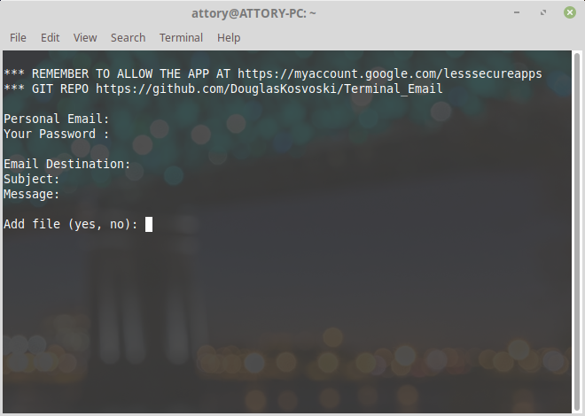

### SMTP-Client

Send emails and attach files all through the Unix-Terminal Interface.

### Features

- Terminal interface;
- Easily modifiable to be autonomous;
- Send to multiple emails at once;
- Attach files (e.g. audio, images, documents).

**To use**

- First you need to allow less secure apps at https://myaccount.google.com/lesssecureapps;
- Be sure to have python3 installed `sudo apt-get install python3`;
- Clone or download the repository: `git clone https://github.com/DouglasKosvoski/Terminal_Email.git`.
- Run `python3 main.py`.
